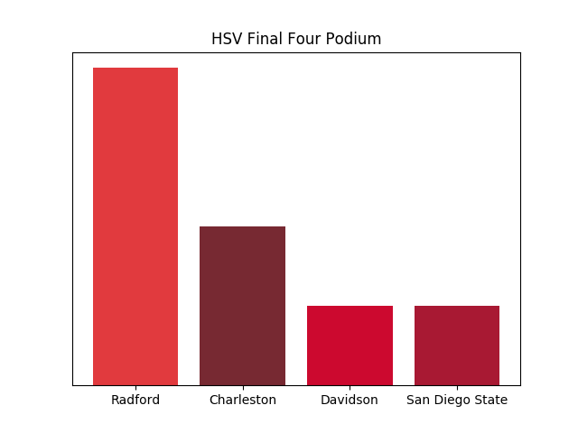

## NCAA 2018 Bracket
*(filled out with color)*

Turns out the tried and true tradition of choosing winners based on color doesn't work out too well (if you trust the seeding).

Picking winners based on HSV is almost the same as picking teams based on how red they are.  So it's no surprise that our Final Four podium looks like this.

We have Radford winning the whole tournament (when they're not even guaranteed to make it to the bracket as of writing this).  No one in our Final Four has a seed better than 11.

The full bracket can be seen in [`hsv_bracket.pdf`](hsv_bracket.pdf).

The bracket was filled out according to the results generated by [`color_bracket.py`](color_bracket.py), and the team colors we're gathered using [`download_team_colors.py`](download_team_colors.py).
